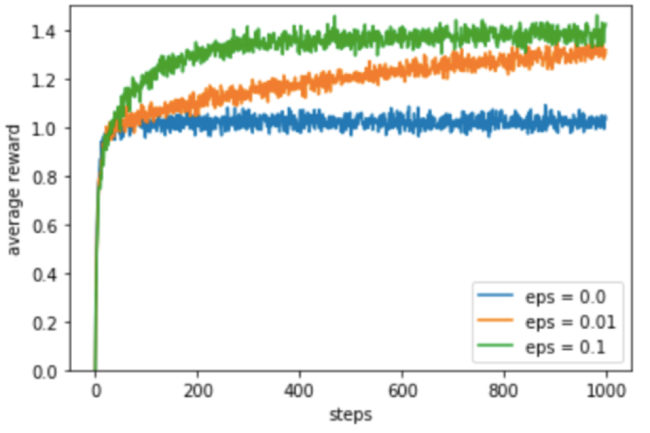
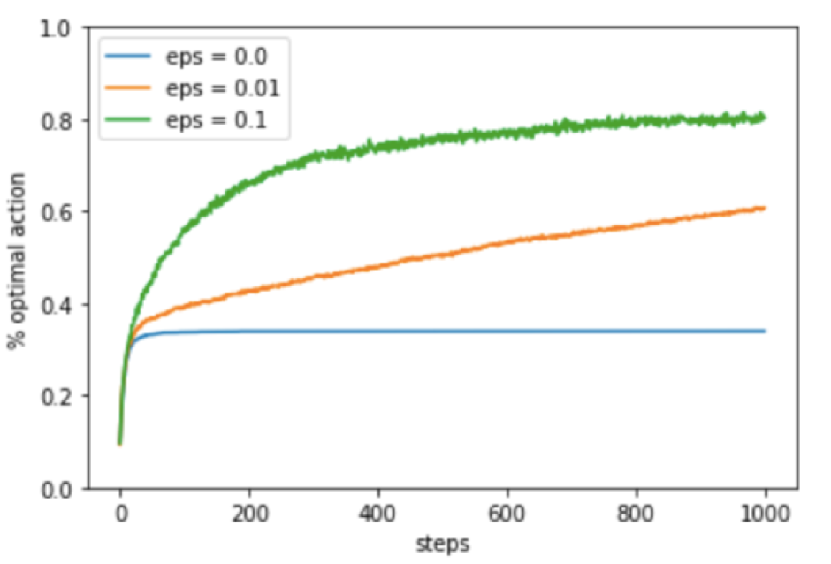

# 10-testbed

Re-implemented the results presented in Figure 2.2 of the Suttion & Bartoo Book comparing a greedy method with two 𝜀-greedy method (𝜀 = 0.01 and 𝜀 = 0.1), on the 10-armed testbed.

## About the problem

The k-armed bandit problem is a classic reinforcement learning example to demonstrate the exploration-exploitation dilemma. In this learning problem, there are K arms (bandits) and each choice (arm) gives player a reward that is chosen from normal probability distribution (mean = 0 and variance = 1). The main objective of this problem is to maximize the expected total reward over a number of selected actions.

The exploration-exploitation dilemma is a fundamental but intractable problem that arises in reinforcement learning, and not in other kinds of learning such as supervised or unsupervised learning. For instance, in an agent-environment model, an agent must prefer actions that it has previously examined in the past and found to be effective in producing reward. However, if an agent moves in an unknown direction, or performs an action it has not tried in the past, that means the agent is exploring the environment. Unfortunately, the agent does not know if exploration will provide an even better reward, hence the exploration-exploitation dilemma.

I compared a greedy method with two 𝜀-greedy methods (𝜀 = 0.01 and 𝜀 = 0.1) with 𝜀 being the probability of exploring new actions that have not been visited yet by a reinforcement learning. Thus, greedy method has 𝜀 = 0 because it will only exploit the past knowledge with zero chance of exploring another actions.

## Results

The performance of a 10-armed testbed was measured to re-implement the results presented in Figure 2.2 of the Sutton and Barton book. This was designed to observe if the agent’s performance and behaviour shall improve with experience over 1000 time steps when applied to one of the bandit problems. It is important to note that 1000 time steps make a one run and this process was repeated roughly 2000 times as it was illustrated in the book.

The first graph shows the increase in expected reward with increased experience (the number of steps) over time. Initially, the greedy method (𝜀 = 0) has improved at a slightly faster rate compared to other methods but with more experience, its performance declined as it has not performed any exploration but only exploiting the sub-optimal actions. The exploration of sub-optimal actions has caused the greedy method to be stuck in a "deadlock" as its performance hasn’t improved and its
appearance resembles that of a straight line compared to the other two methods. The appearance of the 𝜀-greedy methods is similar to the logarithmic shape.

The average performance of the greedy algorithm is roughly around 1.0-1.1 per step compared to
𝜀-greedy methods which achieved much more satisfying results 1.55 and 1.4 for 𝜀 = 0.1 and 𝜀 =
0.01 respectively. The difference between the methods is that the greedy approach was stuck on
exploiting the sub-optimal actions even though in the long term the cumulative reward may not
be as good as other actions. On the other hand, the other methods were taking the delayed reward
into an account as they were focused on exploring the action space to find even better solutions
compared to the currently known solutions.

The second graph shows the increase in the percentage of optimal actions over time. One more time,
the greedy method performed the worst among other methods and identifying the optimal action
in approximately 35% of the tasks. The results of the greedy approach are inadequate because
with experience it didn’t improve its performance and behaviour over time but rather kept choosing
the same sub-optimal actions due to the exploitation. However, the shape 𝜀-greedy methods of
resembles that of the logarithmic function and it is mainly because the continued to explore and to
improve their chances of finding the most optimal solution.

The 𝜀 = 0.1 method explore more actions in the action space as it had 10% of probability for exploration
and the other 90% for exploiting the current knowledge about the action space. Additionally,
the average performance after 500 steps is approximately 80% with its performance being so much
slower compared to performance before 500 steps where the growth was rapid. On the other hand,
the 𝜀 = 0.01 method explored the action space much slower because it only had the probability of
1% of visiting some random action in the action compared to 99% probability which would exploit
the past actions. If the 10-testbed bandit problem was measured on a higher number of steps, then it
is possible that the 𝜀 = 0.01 method would outperform the 𝜀 = 0.1 due to its steady growth constantly
increasing while the growth of 𝜀 = 0.1 has dramatically decreased over time.

